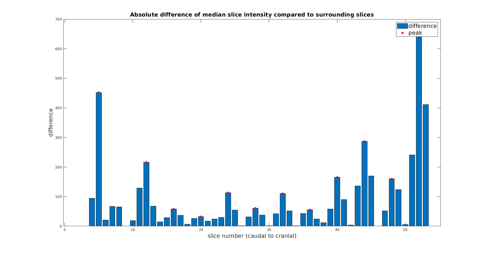
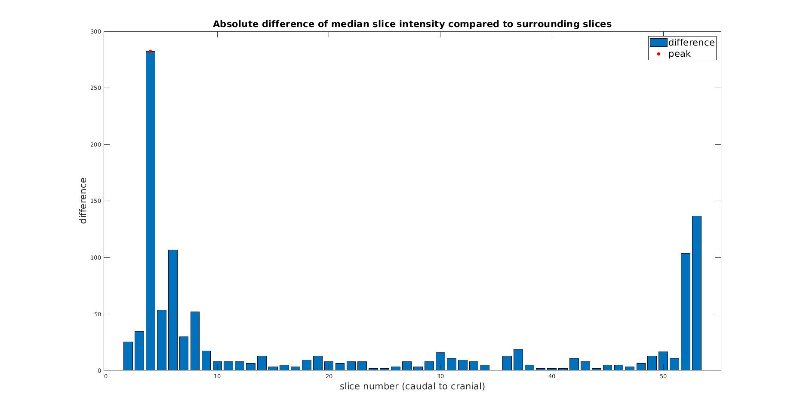

# Motion_detection
Preliminary code and results for automatic motion detection in T2-weighted neonatal MRI scans as supplement to "Improved neonatal brain MRI segmentation by interpolation of motion corrupted slices".

This tool enables automatic motion detection of moderate-severe motion artifacts in T2-weighted neonatal MRI. The absolute median difference between a slice and the two surrounding slcies (before and after) are calculated for all axial slices. Slices with motion artifacts will show a high difference compared to surrounding slices. These peaks can be detected using peak detection, outputting the number of the slices with motion artifacts. Peak detection was performed using PeakSeek1.

1Peter O'Connor (2021). PeakSeek (https://www.mathworks.com/matlabcentral/fileexchange/26581-peakseek), MATLAB Central File Exchange. Retrieved November 11, 2021.

# Evaluation
Preliminary results for automatic motion detection. The mean absolute intensity difference per slice, compared to surrounding slices is plotted. Peak detection (wit minimal peak distance = 3 and threshold = 20) shows slices with a higher absolute difference in voxel intensity (red dots) compared to surrounding slices.

Figure 1: Absolute difference of median slice intensity compared to surrounding slices in a scan with motion artifacts. Blue bars indicate the difference in median voxel intensity and red dots show the peaks, i.e. slices with motion artifacts.

Figure 2: Absolute difference of median slice intensity compared to surrounding slices in a scan without motion artifacts. Blue bars indicate the difference in median voxel intensity and the red dot shows the peak. In this figure, this is a false-positive.
